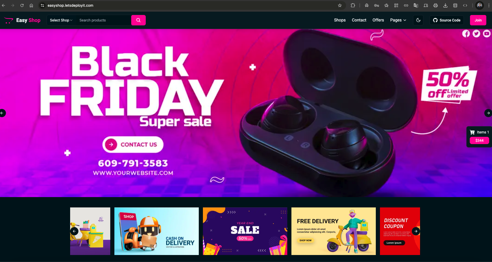

#  **EasyShop** – Modern E-commerce Platform

**EasyShop** is a **full-stack e-commerce platform** built with:

-  **Next.js 14**
-  **TypeScript**
-  **MongoDB**
-  **Tailwind CSS** for UI
-  Secure Authentication
-  Real-time Cart Updates

---

##  Prerequisites

> [!IMPORTANT]  
> Ensure these tools are installed & configured before proceeding:
> 
> - **Terraform**
> - **AWS CLI**
> - **kubectl**
> - **Helm**
> - **Jenkins**
> - **Argo CD**

---

##  Project Setup & Initialization

<details>
<summary><strong> Install & Initialize Terraform</strong></summary>

```bash
# Add HashiCorp repo & install
curl -fsSL https://apt.releases.hashicorp.com/gpg | sudo apt-key add -
sudo apt-add-repository "deb [arch=amd64] https://apt.releases.hashicorp.com $(lsb_release -cs) main"
sudo apt-get update && sudo apt-get install terraform
```

 Verify:
```bash
terraform -v
```

 Initialize:
```bash
terraform init
```

</details>

<details>
<summary><strong> Install & Configure AWS CLI</strong></summary>

```bash
curl "https://awscli.amazonaws.com/awscli-exe-linux-x86_64.zip" -o "awscliv2.zip"
sudo apt install unzip
unzip awscliv2.zip
sudo ./aws/install
aws configure
```

 Provide:
- **AWS Access Key ID**
- **AWS Secret Access Key**
- **Default region name**
- **Output format**

> [!NOTE]  
> Ensure your IAM role has programmatic access and required permissions.

</details>

---

##  Getting Started with Terraform

<details>
<summary><strong>Step-by-step Deployment</strong></summary>

### Clone the Repository
```bash
git clone https://github.com/LondheShubham153/tws-e-commerce-app.git
cd terraform
```

###  Generate SSH Key
```bash
ssh-keygen -f terra-key
chmod 400 terra-key
```

###  Infrastructure Setup
```bash
terraform init
terraform plan
terraform apply
```

>  Confirm with `yes`

###  SSH into EC2
```bash
ssh -i terra-key ubuntu@<public-ip>
```

###  Update Kubeconfig
```bash
aws eks --region eu-west-1 update-kubeconfig --name tws-eks-cluster
kubectl get nodes
```

</details>

---

##  Jenkins Setup

<details>
<summary><strong>Jenkins Access & Plugin Setup</strong></summary>

###  Check Jenkins Status
```bash
sudo systemctl status jenkins
```

###  Get Initial Admin Password
```bash
sudo cat /var/lib/jenkins/secrets/initialAdminPassword
```

###  Start Jenkins (If not running)
```bash
sudo systemctl enable jenkins
sudo systemctl restart jenkins
```

###  Install Plugins
Go to:  
**Manage Jenkins → Plugins → Available Plugins**

Install:
- `Docker Pipeline`
- `Pipeline View`

</details>

<details>
<summary><strong> Jenkins Credentials Setup</strong></summary>

### GitHub Credentials:
> Jenkins → Manage Jenkins → Credentials → Global → Add Credentials
- **Kind:** Username with password
- **ID:** `github-credentials`

### DockerHub Credentials:
> Same path as above
- **Kind:** Username with password
- **ID:** `docker-hub-credentials`
</details>

<details>
<summary><strong> Jenkins Shared Library</strong></summary>

### Add Shared Library
> Manage Jenkins → Configure System → Global Pipeline Libraries

- **Name:** `shared`
- **Version:** `main`
- **Repo URL:** `https://github.com/<your-user>/jenkins-shared-libraries`

>  Ensure repo has: `vars/` directory.
</details>

<details>
<summary><strong> Pipeline Job Setup</strong></summary>

- **Name:** `EasyShop`
- **Type:** `Pipeline`
- **GitHub Repo URL:** `https://github.com/<your-user>/tws-e-commerce-app`

### Triggers
- GitHub hook trigger for GITScm polling

### Pipeline Config
- Definition: `Pipeline script from SCM`
- SCM: `Git`
- Branch: `master`
- Script Path: `Jenkinsfile`

</details>

---

##  Continuous Deployment Setup (CD)

<details>
<summary><strong> Bastion Host + AWS CLI</strong></summary>

### SSH into Bastion
```bash
ssh -i terra-key ubuntu@<bastion-ip>
```

### Configure AWS CLI
```bash
aws configure
```

### Update kubeconfig
```bash
aws eks update-kubeconfig --region eu-west-1 --name tws-eks-cluster
```

</details>

---

##  Argo CD Setup

<details>
<summary><strong> Argo CD Installation & Access</strong></summary>

###  Install Argo CD
```bash
kubectl create namespace argocd
kubectl apply -n argocd -f https://raw.githubusercontent.com/argoproj/argo-cd/stable/manifests/install.yaml
```

###  Monitor Pods
```bash
watch kubectl get pods -n argocd
```

###  Expose Argo CD
```bash
kubectl patch svc argocd-server -n argocd -p '{"spec": {"type": "NodePort"}}'
kubectl port-forward svc/argocd-server -n argocd 8080:443 --address=0.0.0.0 &
```

>  Get admin password:
```bash
kubectl -n argocd get secret argocd-initial-admin-secret -o jsonpath="{.data.password}" | base64 -d; echo
```

</details>

---

## Ingress Controller + HTTPS

<details>
<summary><strong> NGINX Ingress + Cert-Manager</strong></summary>

###  NGINX Installation
```bash
helm repo add ingress-nginx https://kubernetes.github.io/ingress-nginx
helm repo update
kubectl create namespace ingress-nginx

helm install nginx-ingress ingress-nginx/ingress-nginx   --namespace ingress-nginx   --set controller.service.type=LoadBalancer
```

###  Cert-Manager Setup
```bash
helm repo add jetstack https://charts.jetstack.io
helm repo update

helm install cert-manager jetstack/cert-manager   --namespace cert-manager   --create-namespace   --version v1.12.0   --set installCRDs=true
```

</details>

---

##  HTTPS Configuration

<details>
<summary><strong>🔧 Update Manifests for HTTPS</strong></summary>

####  `04-configmap.yaml`
```yaml
NEXT_PUBLIC_API_URL: "https://easyshop.letsdeployit.com/api"
NEXTAUTH_URL: "https://easyshop.letsdeployit.com/"
```

####  `10-ingress.yaml`
```yaml
annotations:
  cert-manager.io/cluster-issuer: "letsencrypt-prod"
  nginx.ingress.kubernetes.io/ssl-redirect: "true"
```

 Apply Changes:
```bash
kubectl apply -f 00-cluster-issuer.yaml
kubectl apply -f 04-configmap.yaml
kubectl apply -f 10-ingress.yaml
```

 Check Status:
```bash
kubectl get certificate -n easyshop
kubectl describe certificate easyshop-tls -n easyshop
```

</details>

---

##  **Congratulations! Deployment Complete!**



>  Your full-stack e-commerce project is now deployed and live!
